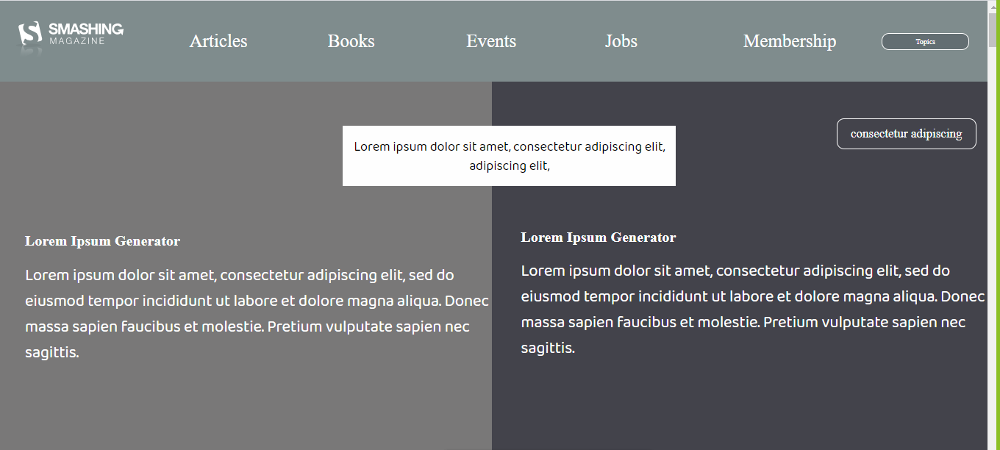

# HTML FORMS

> Creating a Smashing Magazine Website

This project shows the format of designing the layout of a webpage using HTML semantics element and various shades of color gray to structure out the smashing website webpage. 

## Built With

- html, css, javascript
- vscode

## Live Demo

[Live Demo Link](https://rawcdn.githack.com/Daniduran-dev/smashing-magazine/72ef991e3d34dae7d25b8b651f5646c34c4518e4/index.html)

## Getting Started

To get a local copy up and running follow these simple example steps.

### Prerequisites
- Web browser
- Code editor
- Git and Github

### Usage
- Clone the project to your local machine 
- Open the index file in your browser

## Authors

- Okikiola Apelehin
- Daniel Duran 

👤 **Author1**

- Github: [okikiola apelehin](https://github.com/okikiola11)
- Twitter: [okikiola apelehin](https://twitter.com/Kikiolla3)
- Linkedin: [okikiola apelehin](https://www.linkedin.com/in/okikiola-apelehin-459008122/)

👤 **Author2**

- Github: [daniel duran](https://github.com/Daniduran-devr)
- Twitter: [@twitterhandle]()
- Linkedin: [linkedin]()

## 🤝 Contributing

Contributions, issues and feature requests are welcome!

Feel free to check the [issues page](issues/).

## Show your support

Give a ⭐️ if you like this project!

## Acknowledgments

- Google

## 📝 License

This project is [MIT](lic.url) licensed.
